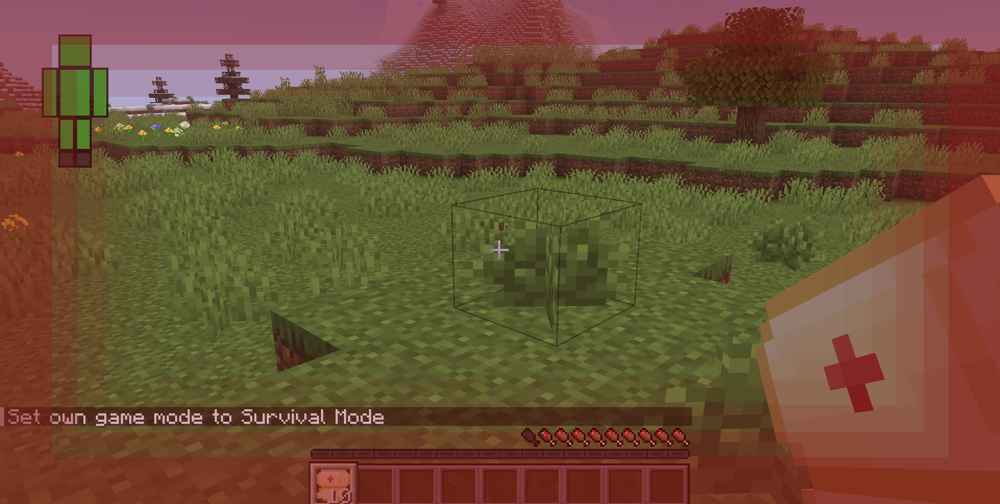
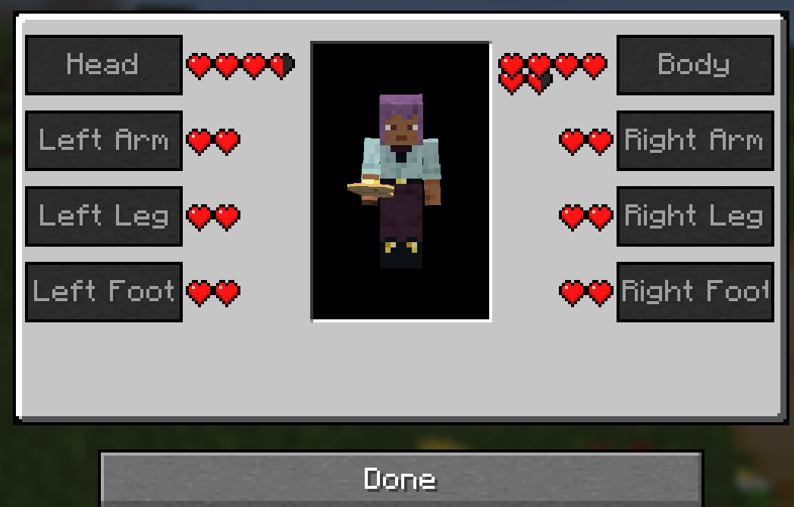
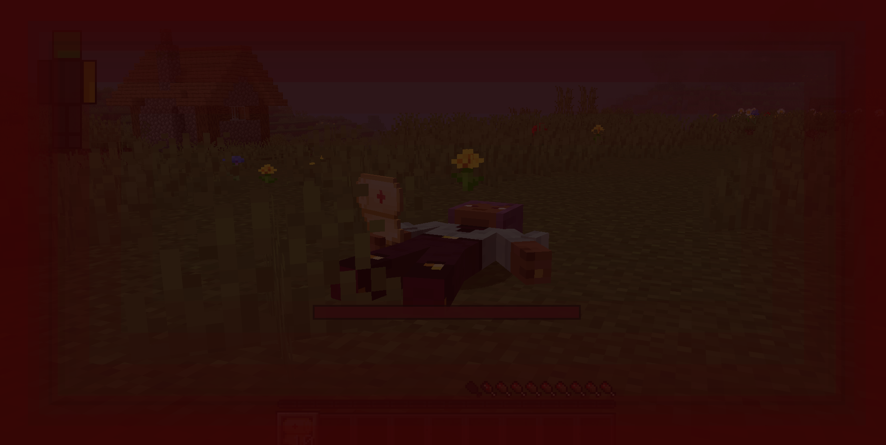

# First Aid New

First Aid New is a port of the original **First Aid** mod by ichttt, updated for modern Minecraft versions and loaders, with expanded realism features, stronger visual effects, and new mechanics such as unconsciousness.

Original project: https://www.curseforge.com/minecraft/mc-mods/first-aid

## Features
- Split-body health system (head, torso, arms, legs, etc.)
- More realistic survival mechanics
- Enhanced vision effects for injuries and status effects
- Additional mechanics (e.g., unconsciousness)

## Supported Minecraft Versions
- 1.21.1
- 1.21.11

## Supported Loaders
- NeoForge
- Fabric

## Screenshots

## Credits & License
- Based on **First Aid** by ichttt.
- This port is distributed under the **GPL-3.0** license, consistent with the original project.
